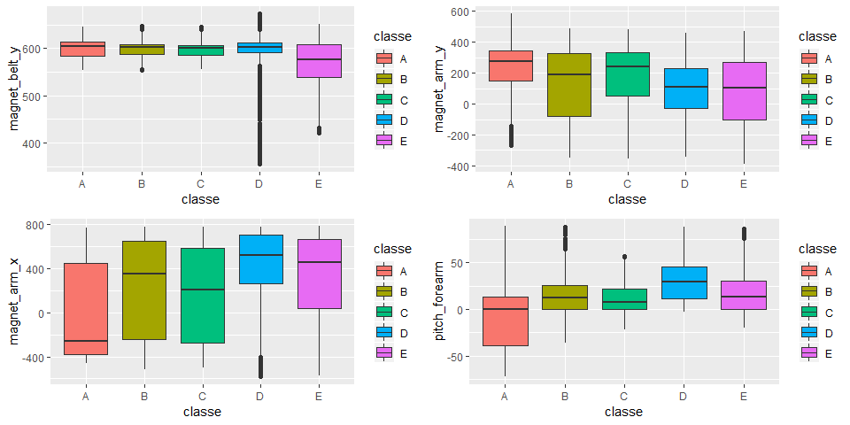

## Goal

The goal of this analysis is to predict what kind of exercise was performed based on the HAR dataset (http://groupware.les.inf.puc-rio.br/har). The dataset contains measurements of movement divided over 159 unique features.

In order to reach this goal we will start by pre-processing the data, followed by an exploratory data analysis. Next, a model will be selected by analysing several different models with cross-validation, after which the results of our final model will be examed on test data. Finally, a conclusion will be drawn in which we answer the question that was posed in the formulation of our goal. 

## Pre-processing

First change 'am' to  factor (0 = automatic, 1 = manual)
And make cylinders a factor as well (since it is not continious)


```r
training.raw <- read.csv("data/pml_training.csv")
testing.raw <- read.csv("data/pml_testing.csv")
```

Obtain information about the dataset with the str function.

```r
str(training.raw)
```

```
## 'data.frame':	19622 obs. of  160 variables:
##  $ X                       : int  1 2 3 4 5 6 7 8 9 10 ...
##  $ user_name               : Factor w/ 6 levels "adelmo","carlitos",..: 2 2 2 2 2 2 2 2 2 2 ...
##  $ raw_timestamp_part_1    : int  1323084231 1323084231 1323084231 1323084232 1323084232 1323084232 1323084232 1323084232 1323084232 1323084232 ...
##  $ raw_timestamp_part_2    : int  788290 808298 820366 120339 196328 304277 368296 440390 484323 484434 ...
##  $ cvtd_timestamp          : Factor w/ 20 levels "02/12/2011 13:32",..: 9 9 9 9 9 9 9 9 9 9 ...
##  $ new_window              : Factor w/ 2 levels "no","yes": 1 1 1 1 1 1 1 1 1 1 ...
##  $ num_window              : int  11 11 11 12 12 12 12 12 12 12 ...
##  $ roll_belt               : num  1.41 1.41 1.42 1.48 1.48 1.45 1.42 1.42 1.43 1.45 ...
##  $ pitch_belt              : num  8.07 8.07 8.07 8.05 8.07 8.06 8.09 8.13 8.16 8.17 ...
##  $ yaw_belt                : num  -94.4 -94.4 -94.4 -94.4 -94.4 -94.4 -94.4 -94.4 -94.4 -94.4 ...
##  $ total_accel_belt        : int  3 3 3 3 3 3 3 3 3 3 ...
##  $ kurtosis_roll_belt      : Factor w/ 397 levels "","-0.016850",..: 1 1 1 1 1 1 1 1 1 1 ...
##  $ kurtosis_picth_belt     : Factor w/ 317 levels "","-0.021887",..: 1 1 1 1 1 1 1 1 1 1 ...
##  $ kurtosis_yaw_belt       : Factor w/ 2 levels "","#DIV/0!": 1 1 1 1 1 1 1 1 1 1 ...
##  $ skewness_roll_belt      : Factor w/ 395 levels "","-0.003095",..: 1 1 1 1 1 1 1 1 1 1 ...
##  $ skewness_roll_belt.1    : Factor w/ 338 levels "","-0.005928",..: 1 1 1 1 1 1 1 1 1 1 ...
##  $ skewness_yaw_belt       : Factor w/ 2 levels "","#DIV/0!": 1 1 1 1 1 1 1 1 1 1 ...
##  $ max_roll_belt           : num  NA NA NA NA NA NA NA NA NA NA ...
##  $ max_picth_belt          : int  NA NA NA NA NA NA NA NA NA NA ...
##  $ max_yaw_belt            : Factor w/ 68 levels "","-0.1","-0.2",..: 1 1 1 1 1 1 1 1 1 1 ...
##  $ min_roll_belt           : num  NA NA NA NA NA NA NA NA NA NA ...
##  $ min_pitch_belt          : int  NA NA NA NA NA NA NA NA NA NA ...
##  $ min_yaw_belt            : Factor w/ 68 levels "","-0.1","-0.2",..: 1 1 1 1 1 1 1 1 1 1 ...
##  $ amplitude_roll_belt     : num  NA NA NA NA NA NA NA NA NA NA ...
##  $ amplitude_pitch_belt    : int  NA NA NA NA NA NA NA NA NA NA ...
##  $ amplitude_yaw_belt      : Factor w/ 4 levels "","#DIV/0!","0.00",..: 1 1 1 1 1 1 1 1 1 1 ...
##  $ var_total_accel_belt    : num  NA NA NA NA NA NA NA NA NA NA ...
##  $ avg_roll_belt           : num  NA NA NA NA NA NA NA NA NA NA ...
##  $ stddev_roll_belt        : num  NA NA NA NA NA NA NA NA NA NA ...
##  $ var_roll_belt           : num  NA NA NA NA NA NA NA NA NA NA ...
##  $ avg_pitch_belt          : num  NA NA NA NA NA NA NA NA NA NA ...
##  $ stddev_pitch_belt       : num  NA NA NA NA NA NA NA NA NA NA ...
##  $ var_pitch_belt          : num  NA NA NA NA NA NA NA NA NA NA ...
##  $ avg_yaw_belt            : num  NA NA NA NA NA NA NA NA NA NA ...
##  $ stddev_yaw_belt         : num  NA NA NA NA NA NA NA NA NA NA ...
##  $ var_yaw_belt            : num  NA NA NA NA NA NA NA NA NA NA ...
##  $ gyros_belt_x            : num  0 0.02 0 0.02 0.02 0.02 0.02 0.02 0.02 0.03 ...
##  $ gyros_belt_y            : num  0 0 0 0 0.02 0 0 0 0 0 ...
##  $ gyros_belt_z            : num  -0.02 -0.02 -0.02 -0.03 -0.02 -0.02 -0.02 -0.02 -0.02 0 ...
##  $ accel_belt_x            : int  -21 -22 -20 -22 -21 -21 -22 -22 -20 -21 ...
##  $ accel_belt_y            : int  4 4 5 3 2 4 3 4 2 4 ...
##  $ accel_belt_z            : int  22 22 23 21 24 21 21 21 24 22 ...
##  $ magnet_belt_x           : int  -3 -7 -2 -6 -6 0 -4 -2 1 -3 ...
##  $ magnet_belt_y           : int  599 608 600 604 600 603 599 603 602 609 ...
##  $ magnet_belt_z           : int  -313 -311 -305 -310 -302 -312 -311 -313 -312 -308 ...
##  $ roll_arm                : num  -128 -128 -128 -128 -128 -128 -128 -128 -128 -128 ...
##  $ pitch_arm               : num  22.5 22.5 22.5 22.1 22.1 22 21.9 21.8 21.7 21.6 ...
##  $ yaw_arm                 : num  -161 -161 -161 -161 -161 -161 -161 -161 -161 -161 ...
##  $ total_accel_arm         : int  34 34 34 34 34 34 34 34 34 34 ...
##  $ var_accel_arm           : num  NA NA NA NA NA NA NA NA NA NA ...
##  $ avg_roll_arm            : num  NA NA NA NA NA NA NA NA NA NA ...
##  $ stddev_roll_arm         : num  NA NA NA NA NA NA NA NA NA NA ...
##  $ var_roll_arm            : num  NA NA NA NA NA NA NA NA NA NA ...
##  $ avg_pitch_arm           : num  NA NA NA NA NA NA NA NA NA NA ...
##  $ stddev_pitch_arm        : num  NA NA NA NA NA NA NA NA NA NA ...
##  $ var_pitch_arm           : num  NA NA NA NA NA NA NA NA NA NA ...
##  $ avg_yaw_arm             : num  NA NA NA NA NA NA NA NA NA NA ...
##  $ stddev_yaw_arm          : num  NA NA NA NA NA NA NA NA NA NA ...
##  $ var_yaw_arm             : num  NA NA NA NA NA NA NA NA NA NA ...
##  $ gyros_arm_x             : num  0 0.02 0.02 0.02 0 0.02 0 0.02 0.02 0.02 ...
##  $ gyros_arm_y             : num  0 -0.02 -0.02 -0.03 -0.03 -0.03 -0.03 -0.02 -0.03 -0.03 ...
##  $ gyros_arm_z             : num  -0.02 -0.02 -0.02 0.02 0 0 0 0 -0.02 -0.02 ...
##  $ accel_arm_x             : int  -288 -290 -289 -289 -289 -289 -289 -289 -288 -288 ...
##  $ accel_arm_y             : int  109 110 110 111 111 111 111 111 109 110 ...
##  $ accel_arm_z             : int  -123 -125 -126 -123 -123 -122 -125 -124 -122 -124 ...
##  $ magnet_arm_x            : int  -368 -369 -368 -372 -374 -369 -373 -372 -369 -376 ...
##  $ magnet_arm_y            : int  337 337 344 344 337 342 336 338 341 334 ...
##  $ magnet_arm_z            : int  516 513 513 512 506 513 509 510 518 516 ...
##  $ kurtosis_roll_arm       : Factor w/ 330 levels "","-0.02438",..: 1 1 1 1 1 1 1 1 1 1 ...
##  $ kurtosis_picth_arm      : Factor w/ 328 levels "","-0.00484",..: 1 1 1 1 1 1 1 1 1 1 ...
##  $ kurtosis_yaw_arm        : Factor w/ 395 levels "","-0.01548",..: 1 1 1 1 1 1 1 1 1 1 ...
##  $ skewness_roll_arm       : Factor w/ 331 levels "","-0.00051",..: 1 1 1 1 1 1 1 1 1 1 ...
##  $ skewness_pitch_arm      : Factor w/ 328 levels "","-0.00184",..: 1 1 1 1 1 1 1 1 1 1 ...
##  $ skewness_yaw_arm        : Factor w/ 395 levels "","-0.00311",..: 1 1 1 1 1 1 1 1 1 1 ...
##  $ max_roll_arm            : num  NA NA NA NA NA NA NA NA NA NA ...
##  $ max_picth_arm           : num  NA NA NA NA NA NA NA NA NA NA ...
##  $ max_yaw_arm             : int  NA NA NA NA NA NA NA NA NA NA ...
##  $ min_roll_arm            : num  NA NA NA NA NA NA NA NA NA NA ...
##  $ min_pitch_arm           : num  NA NA NA NA NA NA NA NA NA NA ...
##  $ min_yaw_arm             : int  NA NA NA NA NA NA NA NA NA NA ...
##  $ amplitude_roll_arm      : num  NA NA NA NA NA NA NA NA NA NA ...
##  $ amplitude_pitch_arm     : num  NA NA NA NA NA NA NA NA NA NA ...
##  $ amplitude_yaw_arm       : int  NA NA NA NA NA NA NA NA NA NA ...
##  $ roll_dumbbell           : num  13.1 13.1 12.9 13.4 13.4 ...
##  $ pitch_dumbbell          : num  -70.5 -70.6 -70.3 -70.4 -70.4 ...
##  $ yaw_dumbbell            : num  -84.9 -84.7 -85.1 -84.9 -84.9 ...
##  $ kurtosis_roll_dumbbell  : Factor w/ 398 levels "","-0.0035","-0.0073",..: 1 1 1 1 1 1 1 1 1 1 ...
##  $ kurtosis_picth_dumbbell : Factor w/ 401 levels "","-0.0163","-0.0233",..: 1 1 1 1 1 1 1 1 1 1 ...
##  $ kurtosis_yaw_dumbbell   : Factor w/ 2 levels "","#DIV/0!": 1 1 1 1 1 1 1 1 1 1 ...
##  $ skewness_roll_dumbbell  : Factor w/ 401 levels "","-0.0082","-0.0096",..: 1 1 1 1 1 1 1 1 1 1 ...
##  $ skewness_pitch_dumbbell : Factor w/ 402 levels "","-0.0053","-0.0084",..: 1 1 1 1 1 1 1 1 1 1 ...
##  $ skewness_yaw_dumbbell   : Factor w/ 2 levels "","#DIV/0!": 1 1 1 1 1 1 1 1 1 1 ...
##  $ max_roll_dumbbell       : num  NA NA NA NA NA NA NA NA NA NA ...
##  $ max_picth_dumbbell      : num  NA NA NA NA NA NA NA NA NA NA ...
##  $ max_yaw_dumbbell        : Factor w/ 73 levels "","-0.1","-0.2",..: 1 1 1 1 1 1 1 1 1 1 ...
##  $ min_roll_dumbbell       : num  NA NA NA NA NA NA NA NA NA NA ...
##  $ min_pitch_dumbbell      : num  NA NA NA NA NA NA NA NA NA NA ...
##  $ min_yaw_dumbbell        : Factor w/ 73 levels "","-0.1","-0.2",..: 1 1 1 1 1 1 1 1 1 1 ...
##  $ amplitude_roll_dumbbell : num  NA NA NA NA NA NA NA NA NA NA ...
##   [list output truncated]
```


As can be seen in the str output, there are a lot of missing values (NA) that will have to be dealt with. If more than twenty percent of the column contains missing values, the column will be removed.


```r
NAColumns <- which(colSums(is.na(training.raw) | training.raw=="") > nrow(training.raw) / 100 * 20)
training <- training.raw[,-NAColumns]
testing <- testing.raw[,-NAColumns]
```

As can also be seen some data points relate to time. These won't be needed for the prediction and thus can be removed.


```r
timeColumns <- grep("timestamp", names(training))
training <- training[,-c(1, timeColumns )]
testing <- testing[,-c(1, timeColumns )]
```

Finally, to further prepare data for analysis, all factor variables are converted to integers.

```r
depedentVarLevels <- levels(training$classe)
training <- data.frame(data.matrix(training))
training$classe <- factor(training$classe, labels=depedentVarLevels)
testing <- data.frame(data.matrix(testing))
```

## Exploratory data analyses 

In order to validate models the training data is further split to obtain a validation set.


```r
set.seed(12345)

classeIndex <- which(names(training) == "classe")

partition <- createDataPartition(y=training$classe, p=0.75, list=FALSE)
training.t <- training[partition, ]
training.v <- training[-partition, ]
```

Next, we'll check the correlations of the dependent variable (classe) with all the independent variables in the
training data.


```r
correlations <- cor(training.t[, -classeIndex], as.numeric(training.t$classe))
bestCorrelations <- subset(as.data.frame(as.table(correlations)), abs(Freq)>0.25)
bestCorrelations
```

```
##             Var1 Var2       Freq
## 15 magnet_belt_y    A -0.2935541
## 27  magnet_arm_x    A  0.2966021
## 28  magnet_arm_y    A -0.2582078
## 44 pitch_forearm    A  0.3394909
```

Only 4 predictors make it above the 0.25 cut-off point. Let's visualize these predictors:


```r
p1 <- ggplot(training.t, aes(classe,magnet_belt_y)) + 
  geom_boxplot(aes(fill=classe))

p2 <- ggplot(training.t, aes(classe, magnet_arm_x)) + 
  geom_boxplot(aes(fill=classe))

p3 <- ggplot(training.t, aes(classe,magnet_arm_y)) + 
  geom_boxplot(aes(fill=classe))

p4 <- ggplot(training.t, aes(classe, pitch_forearm)) + 
  geom_boxplot(aes(fill=classe))


multiplot(p1,p2,p3,p4,cols=2)
```

<!-- -->

Judging from these visualization there is no obvious seperation between classes with just these four features.
We'll have to try a couple more things.

## Model selection 

First we need to get rid of highly inter-correlated features:


```r
correlationMatrix <- cor(training.t[, -classeIndex])
highlyCorrelated <- findCorrelation(correlationMatrix, cutoff=0.9, exact=TRUE)
excludeColumns <- c(highlyCorrelated, classeIndex)
corrplot(correlationMatrix, method="color", type="lower", order="hclust", tl.cex=0.70, tl.col="black", tl.srt = 45, diag = FALSE)
```

<!-- -->

As can be seen in the visualization above, some features are highly correlated. We'll run a PCA analysis on the full
training dataset and on a training dataset that is filtered for the highly inter-correlated features. Next, we'll
fit a predictive model to both datasets to see whether PCA is helpful.


```r
pcaPreProcess.all <- preProcess(training.t[, -classeIndex], method = "pca", thresh = 0.99)
training.t.pca.all <- predict(pcaPreProcess.all, training.t[, -classeIndex])
training.v.pca.all <- predict(pcaPreProcess.all, training.v[, -classeIndex])
testing.pca.all <- predict(pcaPreProcess.all, testing[, -classeIndex])


pcaPreProcess.subset <- preProcess(training.t[, -excludeColumns], method = "pca", thresh = 0.99)
training.t.pca.subset <- predict(pcaPreProcess.subset, training.t[, -excludeColumns])
training.v.pca.subset <- predict(pcaPreProcess.subset, training.v[, -excludeColumns])
testing.pca.subset <- predict(pcaPreProcess.subset, testing[, -classeIndex])
```

Now that we have our PCA dataset we can fit a predictive model. We will go with the randomForest package. We will
run a random forest on the 4 different ways we assembled our dataset:

1. Our 'clean' dataset without further preprocessing.
2. Our 'clean' dataset in which the highly intercorrelated predictors are 'excluded'.
3. A PCA version of our 'clean' dataset without further preprocessing and thus containing 'all' features.
4. A PCA version of our 'clean' dataset without the highly intercorrelated predictors and thus contaning
a 'subset' of our dataset.


```r
ntree <- 100 

rfMod.cleaned <- randomForest(
  x=training.t[, -classeIndex], 
  y=training.t$classe,
  xtest=training.v[, -classeIndex], 
  ytest=training.v$classe, 
  ntree=ntree,
  keep.forest=TRUE,
  proximity=TRUE)

rfMod.exclude <- randomForest(
  x=training.t[, -excludeColumns], 
  y=training.t$classe,
  xtest=training.v[, -excludeColumns], 
  ytest=training.v$classe, 
  ntree=ntree,
  keep.forest=TRUE,
  proximity=TRUE) 

rfMod.pca.all <- randomForest(
  x=training.t.pca.all, 
  y=training.t$classe,
  xtest=training.v.pca.all, 
  ytest=training.v$classe, 
  ntree=ntree,
  keep.forest=TRUE,
  proximity=TRUE)

rfMod.pca.subset <- randomForest(
  x=training.t.pca.subset, 
  y=training.t$classe,
  xtest=training.v.pca.subset, 
  ytest=training.v$classe, 
  ntree=ntree,
  keep.forest=TRUE,
  proximity=TRUE)
```

## Model examination

To examine the four models, their accuracy rates will be compared.

* Note that the last model was too big for my CPU te handle. I still managed to get it running seperately but could not get it into the HTML, which is why I commented it. It's accuracy appeared to be worse than the other three models.


```r
paste0("Accuracy on training clean: ",1-mean(rfMod.cleaned$err.rate))
```

```
## [1] "Accuracy on training clean: 0.988911139721884"
```

```r
paste0("Accuracy on testing clean: ",1-mean(rfMod.cleaned$test$err.rate))
```

```
## [1] "Accuracy on testing clean: 0.993107553875085"
```

```r
paste0("Accuracy on training excluded: ",1-mean(rfMod.exclude$err.rate))
```

```
## [1] "Accuracy on training excluded: 0.988591565025967"
```

```r
paste0("Accuracy on testing excluded: ",1-mean(rfMod.exclude$test$err.rate))
```

```
## [1] "Accuracy on testing excluded: 0.993624549709252"
```

```r
paste0("Accuracy on training PCA all: ",1-mean(rfMod.pca.all$err.rate))
```

```
## [1] "Accuracy on training PCA all: 0.945292876777046"
```

```r
paste0("Accuracy on testing PCA all: ",1-mean(rfMod.pca.all$test$err.rate))
```

```
## [1] "Accuracy on testing PCA all: 0.970610017688947"
```

```r
#paste0("Accuracy on training PCA subset: ",1-mean(rfMod.pca.subsetl$err.rate))
#paste0("Accuracy on testing PCA subset: ",1-mean(rfMod.pca.subset$test$err.rate))
```

## Conclusion

Based on the results above it can be concluded that the PCA did not improve our results. The exclude method seems to be a bit less accurate than the method in which we use all variables. However, as this difference is almsot negligble we'll stick we the exclude method as this method is computationally more efficiently.

Now it's time to run our optimal model on the test data.

# Test results


```r
predict(rfMod.exclude, testing[, -excludeColumns])
```

```
##  1  2  3  4  5  6  7  8  9 10 11 12 13 14 15 16 17 18 19 20 
##  B  A  B  A  A  E  D  B  A  A  B  C  B  A  E  E  A  B  B  B 
## Levels: A B C D E
```
